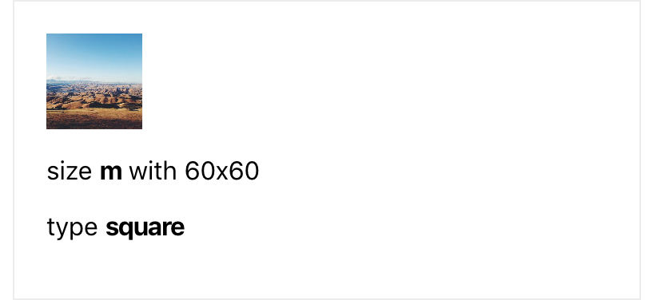
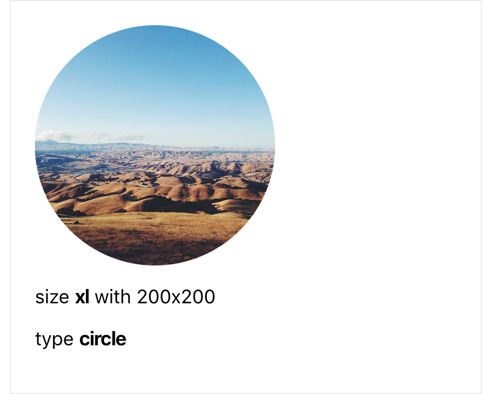
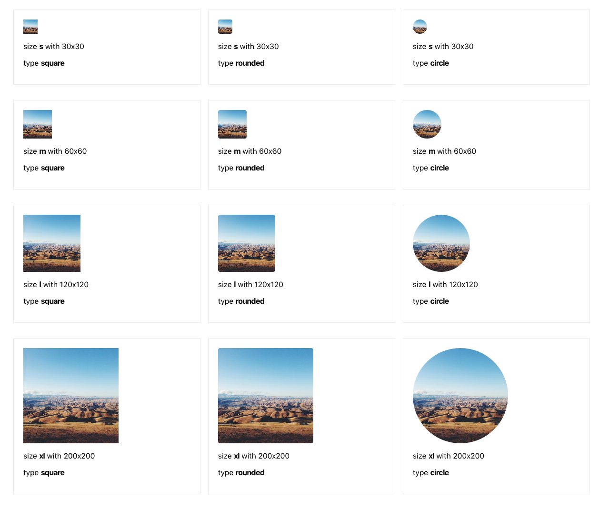

# Customizable avatar component

You are tasked with creating an Avatar component to use in a React application. The component will essentially display an image.
But it also needs to be customizable with multiple variations.

It can have 4 different sizes: 

* s - 30 x 30
* m - 60 x 60
* l - 120 x 120
* xl - 200 x 200

In addition, it can have 3 different styles:

* square
* rounded (with border-radius of 8px)
* circle

Size `m` and type `square` are the ones used by default.
It should be possible to use my component like this: 

```
    <Avatar src="https://picsum.photos/400/400" />
```



Without specifying any size and type, this avatar should be displayed as square with size m (60x60) as they are the default sizes.

If I specify a size and type they should be applied accordingly.

```
    <Avatar
        src="https://picsum.photos/400/400"
        size="xl"
        type="circle" />
```

This avatar should be displayed as circle with size xl (200x200) as they are specified as props.



Here is an overview of all possible combinations:



Use [create react app](https://create-react-app.dev/) to setup your project.

Please note, the card and the description texts are not part of the avatar component.